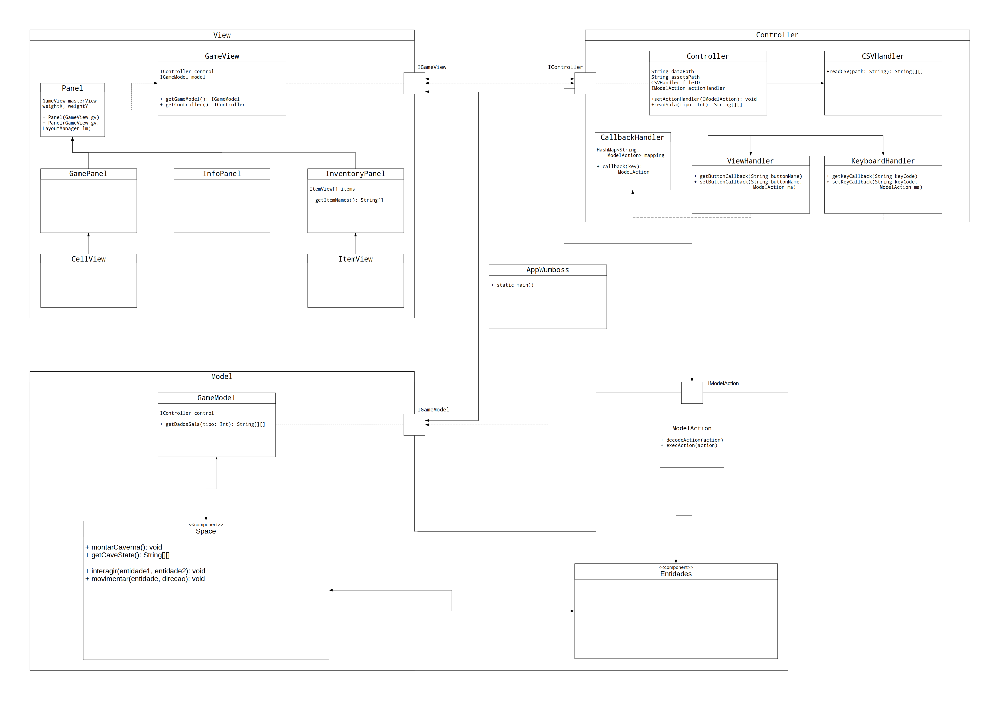
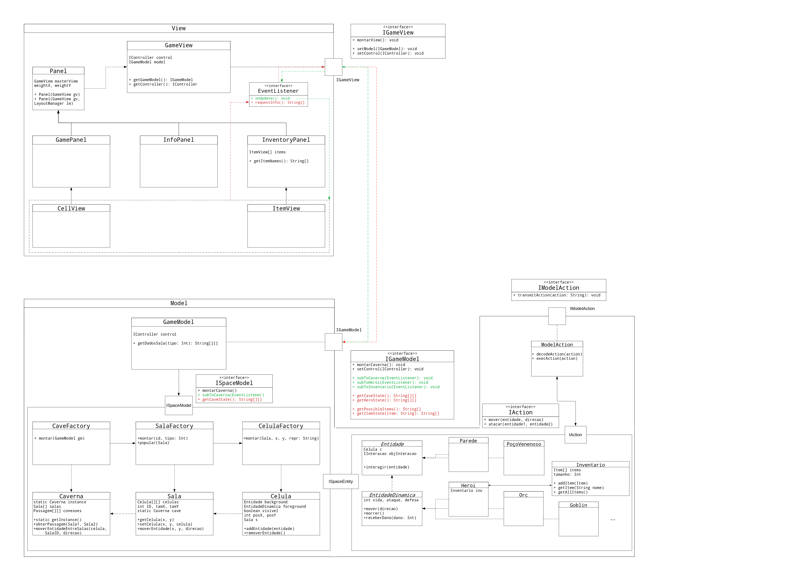

# O submundo de Wumboss
## Descrição resumida
O _Submundo de Wumboss_ é um jogo criado em Java, pensado como uma continuação do jogo [O mundo de Wumpus](https://en.wikipedia.org/wiki/Hunt_the_Wumpus). Nele, o herói cai em um buraco do primeiro jogo, mas milagrosamente consegue sobreviver. Agora, sua missão é explorar as cavernas abaixo do mundo de Wumpus, coletando itens que o ajudarão em sua jornada, matando inimigos e finalmente, derrotando _Wumboss_, que guarda a saída da caverna.

## Equipe
* Victor Costa Dominguite - RA 245003
* Thiago Donato Ferreira - RA 194300

## Vídeos do Projeto
### Vídeo da prévia
[Vídeo de apresentação inicial do jogo](https://drive.google.com/file/d/1lccrVUTai-J20fjwlvtDMPQStChpDiqT/view?usp=sharing)
### Vídeo do jogo

## Slides do Projeto 
### Slides da prévia
[Slides de apresentação inicial do jogo](https://docs.google.com/presentation/d/1Me5ZMq8UdEnHFej91MhEyC3Btpk-YnCvo0WzEDYdrdM/edit?usp=sharing)
### Slides da Apresentação Final
[Slides de apresentação final do jogo](https://docs.google.com/presentation/d/1mRQyarQHMtyBF4gRG0BXxCCoWIqquhXTJSRBX5N_6VM/edit?usp=sharing)

## Relatório de Evolução
Ao longo do desenvolvimento do jogo, não houve mudanças fundamentais em relação ao design inicial planejado. Porém, vale ressaltar que a complexidade de se implementar o jogo se demonstrou maior do que esperada, o que fez com que, durante seu desenvolvimento, fosse necessária a criação de mais sub-componentes (como pode ser observado no diagrama de componentes) e interfaces para conectar efetivamente os principais componentes do jogo (isto é, model, view e controller).

Algumas dificuldades enfrentadas envolveram a conexão entre componentes, sem que houvesse uma interdependência muito grande entre classes. Ou seja, a divisão das funções em componentes que funcionam independentemente um do outro foi um desafio.

Além disso, também houve difiuldade em sincronizar o view e o model, para que as mudanças que ocorressem internamente no jogo fossem imediatamente atualizadas na interface gráfica.

Como nenhum dos integrantes do grupo havia anteriormente utilizado interfaces gráficas, essa foi uma grande novidade, que gerou dúvidas em sua implementação, porém, por fim, acabou somando como um aprendizado. Semelhantemente, a noção de definir um projeto de jogo com uma arquitetura específica também foi algo novo, que gerou certas dificuldades, porém, ao fim, foi algo positivo, uma vez que reforçou a importância de se pensar melhor na organização geral do programa como um todo, antes de começar a implementá-lo, para evitar que seja necessário realizar muitos ajustes no meio do desenvolvimento.

## Destaques do Código

A movimentação dos personagens foi feita baseada em direções, que foram implementadas como um "enum", facilitando consideravelmente a comunicação dos comandos do controller para o model, além de também facilitar a implementação da movimentação internamente no model.

~~~java
public enum Direcao {
    NORTE, LESTE, SUL, OESTE;
	
    public static Direcao randomDir(Random r) {
    	return Direcao.values()[r.nextInt(4)];
    }
    
    ...
    
    public static Direcao fromString(String s) {
    	if(s.equals("up") || s.equals("cima") || s.equals("norte"))
    		return Direcao.NORTE;
    	if(s.equals("down") || s.equals("baixo") || s.equals("sul"))
    		return Direcao.SUL;
    	if(s.equals("left") || s.equals("esquerda") || s.equals("oeste"))
    		return Direcao.OESTE;
    	if(s.equals("right") || s.equals("direita") || s.equals("leste"))
    		return Direcao.LESTE;
    	
    	return null;
    }

    ...
}
~~~

O espaço do jogo é uma caverna composta de 10 salas de espaço interno 9 x 9. A formação da caverna é feita com base em 30 arquivos modelos de salas, fazendo com que a experiência do jogador seja diferente a cada vez que o jogo é rodado, uma vez que a caverna é montada de maneira diferente toda vez que o jogo é iniciado.

~~~java
public static Caverna montar() {
    Caverna cave = new Caverna();
    ArrayList<Integer> tiposSalas = new ArrayList<Integer>();

    for (int i = 0; i < Constantes.NUM_SALAS_CAVERNA - 1; i ++) {
    	tiposSalas.add(i);
    }
    
    // Faz com que as salas de cada tipo estejam sempre em ordem diferente
    Collections.shuffle(tiposSalas);

    ...

    // As salas de índice i são montadas com base nos tipos de sala
    // que constam na lista "tiposSalas"
    for (int i = 1; i < Constantes.NUM_SALAS_CAVERNA - 1; i++) {
    	Sala atual = SalaFactory.montar(i, tiposSalas.get(i));

    	cave.setSala(i, atual);
    }
    
    ...

    // Conecta as salas subsequentes, com passagens geradas em lugares 
    // aleatórios ao longo de sua borda
    for (int i = 0; i < Constantes.NUM_SALAS_CAVERNA - 1; i++) {
    	anterior = criarPassagem(cave.getSala(i), cave.getSala(i + 1), anterior);
    }

    return cave;
}

...

public String[][] readSala(int tipo) throws TipoDeSalaInvalido, IOException {
		String[][] res;
		String path;
		
        // Há 3 modelos disponíveis para cada tipo de sala. O modelo da sala
        // é definido aleatoriamente
		int modelo = Constantes.rng.nextInt(3) + 1;

		if(tipo < 10)
			path = dataPath + "tipo0" + tipo + "/sala0" + modelo + ".csv";
		else
			path = dataPath + "tipo" + tipo + "/sala" + modelo + ".csv";
		
		try {
			res = fileIO.readCSV(path);
		} catch(FileNotFoundException e) {
			throw new TipoDeSalaInvalido(tipo);
		}
		
		if(res == null) 
			throw new IOException();
		
		return res;
	}
~~~

No jogo, quando os inimigos entram no campo de visao do herói, eles são alertados e passam a perseguir o herói. Assim, toda vez que o herói se move, os inimigos também se movem em sua direção. Porém, alguns inimigos mais pesados se movem mais lentamente. O destaque do trecho a seguir se deve à simplicidade com que a atualização da movimentação dos inimigos em ritmos diferentes é implementada.

~~~java
public void atualizarVisaoEInimigos() {
    
    ...

    // Faz com que todos os inimigos em alerta na sala se movam em direção ao
    // herói, caso o seu movimento não estiver em cooldown
	for (IInimigo i : inimigosAlerta) {
        // globalTimer é incrementado a cada movimento do herói e o cooldown do
        // movimento simboliza com que frequência (1 ou 2) o inimigo se move
		if (i != null && globalTimer % i.getCooldownMovimento() == 0)
			i.moverEmDirecaoA(heroiX, heroiY);
	}
}
~~~

## Destaques de Pattern

Foi utilizado o design pattern Model - View - Controller (MVC)

### Diagrama do Pattern

Na seção **Documentação dos Componentes** mais abaixo, é possível encontrar diagramas que ilustram detalhadamente a conexão feita entre Model, View e Controller, que determina o pattern utilizado no desenvolvimento do jogo.

### Código do Pattern

A trasmissão de comandos entre os componentes Controller e Model tem como intermediária a classe ModelAction.

~~~java

public class ModelAction implements IActionParser {
    private HashMap<String, IActionExecutor> mappings;
    
    public ModelAction() {
    	mappings = new HashMap<String, IActionExecutor>();
    }

    ...

	// A partir de uma string padronizada, o comando é obtido e repassado
	private void parseMessage(String message) {
		String[] splitMessage = message.split(" ");
		
		IActionExecutor actor = mappings.get(splitMessage[0]);
		if(actor == null)
			throw new MensagemInvalida("Controller", "ModelAction", message);
		
		String action = splitMessage[1];
		String[] args = new String[splitMessage.length - 2];
		
		for(int i = 2; i < splitMessage.length; i++)
			args[i-2] = splitMessage[i];
		
        // O comando é passado para ator especificado, o qual comunicará a ação
        // ao seu correspondente no model
		sendAction(actor, action, args);
	}

	...

}

~~~

A interface gráfica do jogo foi dividida em 3 seções principais: um painel para o inventário do herói, um painel de informaçoes gerais e um para a visualização da caverna em si. Cada um desses precisa ser atualizado conforme o decorrer do jogo. Essa atualização foi unificada pela interface Observer, que permite que a classe EventCreator, responsável pela atualização do View, não tenha que saber qual painel está sendo referenciado para atualizá-lo.

~~~java

public interface Observer {
	public void onUpdate();
	public void onUpdate(boolean reinscrever);
	public String[] getInfo();
}

public abstract class EventCreator implements IEventCreator{
	protected ArrayList<Observer> listeners;
    // Listeners engloba todos aqueles que precisam ser atualizados

    ...

~~~

A construção da caverna é feita completamente usando Factories. A caverna como um todo é montada pela CaveFactory. Sendo a caverna formada de salas, a CaveFactory utiliza da SalaFactory para formar as salas, a qual, por sua vez, utiliza da CelulaFactory. Essa última, em muitos casos contém alguma Entidade, como um personagem ou item e, dessa forma, utiliza do ForegroundFactory para montar esses elementos.

~~~java

public class CaveFactory {

    ...

	public static Caverna montar() {
		Caverna cave = new Caverna();
		
        ...

        // SalaFactory cuidará da formação de uma sala específica
		cave.setSala(0, SalaFactory.montar(0, tiposSalas.get(0)));

        ...
    
		return cave;
	}

    ...

}

public class SalaFactory {
	
    ...

	public static Sala montar(int id, int tipo) {
		
        ...
        
		Sala s = new Sala(id, Constantes.TAM_SALAS, Constantes.TAM_SALAS);
		int x = 0, y = 0;
		
		try {
			String[][] template = io.readSala(tipo);
            
			// As células da sala são montadas com base no arquivo lido
			for(String[] linha : template) {
				for(String celula : linha) {
                // CelulaFactory cuidará da formação de uma célula específica
					s.setCelula(x, y, CelulaFactory.montar(x, y, celula));
					x += 1;
				}
				x = 0;
				y += 1;
			}
		
        ...
		
        return s;
	}
	
}

public class CelulaFactory {
	
    ...
	
	public static ICelula montar(int x, int y, String repr) {
        // A célula é montada com base na String passada a ela que a representa
		Celula c = new Celula(x, y, decodeRawEntity(repr));

        // Caso houver algum item ou entidade viva nessa célula, a 
        // ForegroundFactory é responsável por criá-lo
		Entidade e = ForegroundFactory.decodeRawEntity(repr);
		if (e != null) {
			e.connect(Space.getInstance());
			c.pushEntidade((IEntidadeDinamica) e);
		}
		return c;
	}
}

public class ForegroundFactory {
    
    ...

	public static Entidade decodeRawEntity(String repr) {
        // A entidade (item ou criatura) é criada a partir da string
        // que a representa
		Class<? extends Entidade> classe = tabela.get(repr);
		if(classe == null) return null;
		
		Entidade result = null;
		
		try {
			result = classe.getConstructor().newInstance();
		} 

        ...
		
		return result;
	}
}

~~~

## Conclusões e Trabalhos Futuros
Repensando o processo de implementação do jogo, chegamos à conclusão de que a arquitetura poderia ter sido mais bem planejada previamente ao início da escrita do código, de forma a tornar o programa mais robusto e com maior independência das classes e componentes.

Ademais, há certas funcionalidades que deixamos de implementar no jogo por falta de tempo, mas que possivelmente ainda implementaremos no futuro. Dentre essas: a opção de salvar o progresso no jogo e retomar em seguida, a sala do Wumboss não sendo necessariamente a última, mais personagens, tamanho variável das salas, movimentação mais inteligente dos inimigos, geração completamente aleatória e independente de arquivos modelo da caverna, entre outras.

De maneira geral, aprendemos bastante sobre a prática de orientação a objetos com esse projeto, além de também termos tido nosso contato inicial com interfaces gráficas e com a noção de arquiteturas. Também pode-se mencionar a aquisição de uma maior prática e o desenvolvimento de nossas habilidades com a linguagem de programação Java.

## Documentação dos componentes
## Diagramas
### Diagrama geral do projeto

### Diagrama geral de componentes

### **Componente Model**

#### Ficha Técnica
item | detalhamento
--- | ---
Classes | src.src.model.GameModel, src.src.model.ModelAction
Autores | Thiago e Victor
Interface | IGameModel

### **Componente View**

#### Ficha Técnica
item | detalhamento
--- | ---
Classe | src.src.view.GameView
Autores | Thiago e Victor
Interface | IGameView

### **Componente Controller**

#### Ficha Técnica
item | detalhamento
--- | ---
Classe | src.src.controller.Controller
Autores | Thiago e Victor
Interface | IController

*OBS: As informações a respeito das interfaces associadas a cada componente encontram-se na seção abaixo*

## Detalhamento das interfaces

### **Interface IController**
Interface provida pelo Conroller para receber comandos externos e ler arquivos
~~~java

public interface IController extends IActionCreator{
	public String[][] readSala(int tipo) throws TipoDeSalaInvalido, IOException;
	public BufferedImage readIcon(String name) throws IOException;
	public File hackFontFile(String mode);
	
	public void setKeyboardMappings(InputMap im, ActionMap am);
	public void setButtonMappings(JButton b);
}

~~~

Método | Objetivo
--- | ---
`readSala` | Retorna uma matriz de strings que corresponde a uma sala lida de um arquivo CSV
`readIcon` | Retorna a imagem correspondente ao ícone solicitado
`hackFontFile` | Retorna o arquivo de uma fonte
`setKeyboardMappings` | Mapeia as teclas que devem ser observadas
`setButtonMappings` | Adiciona um botão que deve ser observado

### **Interface IGameModel**
Interface provida pelo Model para inicializar o jogo, atualizar suas informações e obter informações do seu estado atual.
~~~java

public interface IGameModel {
	/* Inicializacao */
		public void start();
		public void setControl(IController c);
	
	/* Interacao com os outros componentes */
		/* Observer pattern */
		public void subToLocal(int x, int y, Observer e);
		public void subToHeroi(String info, Observer e);
		public void subToItem(String item, Observer e);
		
		/* Requerir informacoes */
		
		/* Retorna o estado da caverna em dada posição, na seguinte forma
		 * String[3] = {nome do background, nome do foreground, estado}
		 * */
		public String[] getCaveState(int x, int y);
		
		/* Retorna o estado do herói relevante ao View
		 * O retorno eh apenas um numero em formato de String
		 * na primeira posicao do array
		 * */
		public String[] getHeroState(String item);
		
		public String[] getPossibleCollectableItems();
		public String[] getPossibleCumulativeItems();
		
		/* Retorna o item de nome dado, na seguinte forma
		 * String[3] = {descricao, estaColetado?, estaEquipado?}
		 * */
		public String[] getItemState(String itemName);
}
~~~

Método | Objetivo
--- | ---
`start` | Inicializa o jogo
`setControl` | Conecta Model ao Controller
`subToLocal` | Indica quando algo se altera no espaço
`subToHero` | Indica quando algo se altera no Heroi
`subToItem` | Indica quando algo se altera em um item do inventário
`getCaveState` | Retorna informações sobre o estado atual de uma posição na sala ativa
`getHeroState` | Retorna o estado atual do herói
`getPossibleCollectableItems` | Retorna uma lista de todos os itens únicos do inventário
`getPossibleCumulativeItems` | Retorna uma lista de todos os itens que acumulam do inventário
`getItemState` | Retorna informações sobre um certo item do inventário

### **Interface ISpace**
Interface provida pela espaço para atualizar suas informações, assim como obtê-las
~~~java

public interface ISpace extends IActionExecutor{
	public void connectHero(IHeroi hero);
	public void disconnectHero();
	public void destroy();
	
	public void subToLocal(int x, int y, Observer e);
	
	public boolean moverEntidade(int x, int y, Direcao dir);
	public void addEntidade(int x, int y, IEntidadeDinamica e);
    public IEntidadeDinamica removerEntidade(int x, int y);
    
    public void atacar(IEntidadeViva e, int x, int y);
    
    public int distanciaAte(int xIni, int yIni, int xFim, int yFim);

	public void atualizarVisaoEInimigos();
    public String[] estadoAtual(int x, int y);
    public void refreshLocal(int x, int y);
}

~~~

Método | Objetivo
--- | ---
`connectHeroi` | Obtém uma referência ao herói
`disconnectHero` | Desvincula o herói ao espaço
`destroy` | Destrói o espaço criado para recomeçar o jogo
`subToLocal` | Indica quando algo se altera no espaço
`moverEntidade` | Move uma Entidade para uma certa direção
`addEntidade` | Adiciona uma Entidade em uma certa posição da sala atual
`removerEnridade` | Remove uma Entidade de uma certa posição da sala atual
`atacar` | Faz uma entidade atacar outra
`distânciaAte` | Retorna a distância entre dois pontos na sala atual
`atualizarVisaoEInimigos` | Atualiza a visão do herói após se movimentar e a movimentação e ataque de inimigos
`estadoAtual` | Retorna informações sobre uma célula (x, y) da sala atual
`refreshLocal` | Atualiza a visibilidade de uma célula (x,y) da sala atual

### **Interface ICaveProperties**
Interface provida pela caverna para obter informações básicas
~~~java

public interface ICaveProperties{
	public ISala getSalaAtiva();
	
	public String[] estado(int x, int y);
}
}

~~~

Método | Objetivo
--- | ---
`getSalaAtiva` | Retorna a sala ativa atualmente no jogo
`estado` | Retorna informações sobre uma célula (x, y) da sala ativa

### **Interface ICave**
Interface provida pela caverna para realizar alterações nela
~~~java

public interface ICave extends ICaveProperties{
	public boolean moveEntidade(int x, int y, Direcao dir);
	public void addEntidade(int x, int y, IEntidadeDinamica e);
    public IEntidadeDinamica removeEntidade(int x, int y);
    
    public void atacar(IEntidadeViva e, int x, int y);
    
    public void subToLocal(int x, int y, Observer e);
    public void destroy();
}

~~~

Método | Objetivo
--- | ---
`moveEntidade` | Move uma Entidade para uma certa direção
`addEntidade` | Adiciona uma Entidade em uma certa posição da sala atual
`removeEnridade` | Remove uma Entidade de uma certa posição da sala atual
`atacar` | Faz uma entidade atacar outra
`subToLocal` | Indica quando algo se altera no espaço
`destroy` | Destrói a instância da caverna

### **Interface ISala**
Interface provida pela Sala para obter informações a seu respeito e alterá-las
~~~java

public interface ISala {
	public int getTamX();
	public int getTamY();
	public int getID();
	public String[] estado(int x, int y);
	
	public void inativar();
	
	public void addEntidade(int x, int y, IEntidadeDinamica e);
	public IEntidadeDinamica removeEntidade(int x, int y);
	
	public boolean outOfBounds(int x, int y);
	public ICelula getCelula(int x, int y);
	
	public void subToLocal(int x, int y, Observer e);
	public void destroy();

}

~~~

Método | Objetivo
--- | ---
`getTamX` | Retorna a largura da sala
`getTamY` | Retorna a altura da sala
`getID` | Retorna o ID da sala
`estado` | Retorna informações sobre uma célula (x, y)
`inativar` | Torna a sala inativa
`addEntidade` | Adiciona uma Entidade em uma certa posição
`removeEnridade` | Remove uma Entidade de uma certa posição
`outOfBounds` | Verifica se uma posição (x,y) está dentro da sala
`getCelula` | Retorna a célula numa posição (x,y)
`subToLocal` | Indica quando algo se altera na sala
`destroy` | Destrói a sala

### **Interface ICelula**
Interface provida pela Célula para obter informações a seu respeito e alterá-las
~~~java

public interface ICelula {
	public IEntidadeEstatica getBackground();
	public void setBackground(IEntidadeEstatica e);
	
	public void pushEntidade(IEntidadeDinamica ent);
	public IEntidadeDinamica popEntidade();
	public IEntidadeDinamica peekEntidade();
	
	public boolean isVisivel();
	public void setVisivel(boolean visivel);
	public void inativar();
	public void destroy();
	
	public void subscribe(Observer o);
	public String[] estado();
}

~~~

Método | Objetivo
--- | ---
`getBackground` | Retorna a Entidade de fundo da célula
`setBackground` | Altera a Entidade de fundo da célula
`pushEntidade` | Altera a Entidade principal da célula
`peekEntidade` | Retorna a Entidade principal da célula
`isVisivel` | Retorna se a célula está visível
`setVisivel` | Altera o valor de "visível"
`inativar` | Torna a célula inativa
`destroy` | Destrói a célula
`subscribe` | Indica quando algo se altera na célula
`estado` | Retorna informações sobre a célula

### **Interface IActionCreator**
Interface provida por alguém que receba os comandos e os repasse para um ActionParser
~~~java

public interface IActionCreator{
	public void connect(IActionParser agent);
	public void disconnect();
}

~~~

Método | Objetivo
--- | ---
`connect` | Conceta o ActionCreator a um ActionParser
`disconnect` | Desconceta o ActionParser

### **Interface IActionParser**
Interface provida por alguém que repasse as ações para um ActionExecutor
~~~java

public interface IActionParser{
	public void connect(String name, IActionExecutor agent);
	public void disconnectFromAll();
	public void sendMessage(String action, String... args);
}

~~~

Método | Objetivo
--- | ---
`connect` | Conceta o ActionParser a um ActionExecutor
`disconnectFromAll` | Desconceta todos ActionExecutor
`sendMessage` | Manda uma ação para um ActionExecutor

### **Interface IActionExecutor**
Interface para passagem da ação para o objeto que a realizará
~~~java

public interface IActionExecutor{
	/* Send a message to this object */
    public void sendMessage(String action, String... args);
}

~~~

Método | Objetivo
--- | ---
`sendMessage` | Manda uma ação para o objeto que irá realizá-la

### **Interface IEventCreator**
Interface parao manuseio de listeners
~~~java

public interface IEventCreator {
	public void subscribe(Observer e);
	public void disconnectAll();
}

~~~

Método | Objetivo
--- | ---
`subscribe` | Adiciona um listeners à lista de observers
`disconnectAll` | Limpa a lista de observers

### **Interface Observer**
Interface para a atualização de observers
~~~java

public interface Observer {
	public void onUpdate();
	public void onUpdate(boolean reinscrever);
	public String[] getInfo();
}

~~~

Método | Objetivo
--- | ---
`onUpdate` | Faz com que o Observer atualize
`getInfo` | Obtém informações a respeito do Observer

### **Interface IGameView**
Interface provida pelo View para sua inicialização e alteração
~~~java

public interface IGameView {
	public void setControl(IController c);
	public void setModel(IGameModel g);
	
	public void montarView();
	public void showView();
	
	public void rebuild();
	
	public static void setFeedMessage(String message) {
		InfoPanel.setFeed(message);
	}
	
	public static void setFeedMessage(String message, Color c) {
		InfoPanel.setFeed(message, c);
	}

~~~

Método | Objetivo
--- | ---
`setControl` | Conecta ao Controller
`setModel` | Conecta ao Model
`montarView` | Monta os painéis do view
`showView` | Torna os painéis visíveis
`rebuild` | Remonta o View
`setFeedMessage` | Altera a mensagem mostrada no painel de informações do jogo

As demais interfaces foram utilizadas como forma de desacoplar as partes do programa, mas não possuem um papel tão significativo para a estrutura do jogo como as descritas acima, por isso, não foram mencionadas.

## Plano de exceções

### Diagrama da hierarquia de exceções
Todas as exceções são independentes, não herdando uma da outra.

### Descrição das classes de exceção

Classe | Descrição
--- | ---
IDInvalido | Indica que houve tentativa de acesso a uma sala de ID inválido na caverna.
MensagemInvalida | Indica que foi passada uma String inválida contendo o comando de ação interpretado pelo Controller
SemControllerNaMontagem | Indica que houve tentativa de montagem da caverna sem haver Controller disponível para ler arquivos
SemReferenciaAComponente | Indica que não há referência ao Controller ou View no Model
ErroDeInteracao | Indica que houve erro de interação entre Entidades no Model